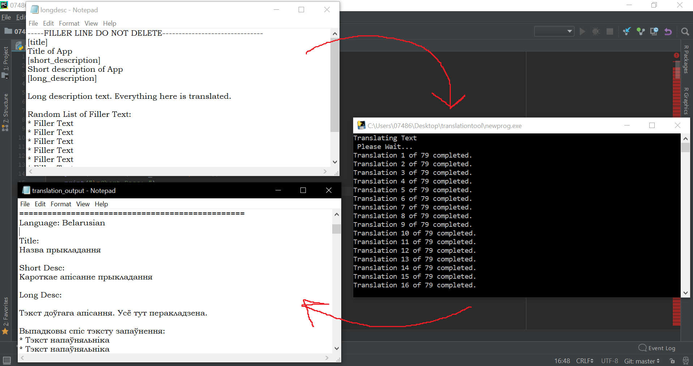

# Mobile_App_Translation_Tool_Python
A python based translation tool that uses mouuff mtranslate library to translate title, and descriptions in a text file to 80 different languages using googles api.

# How to use program

Use at your own risk.

